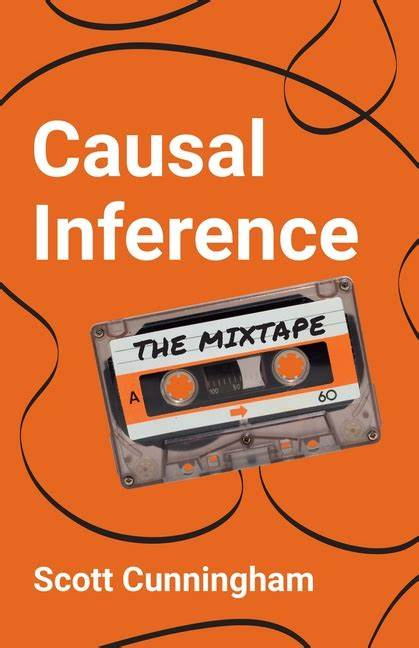
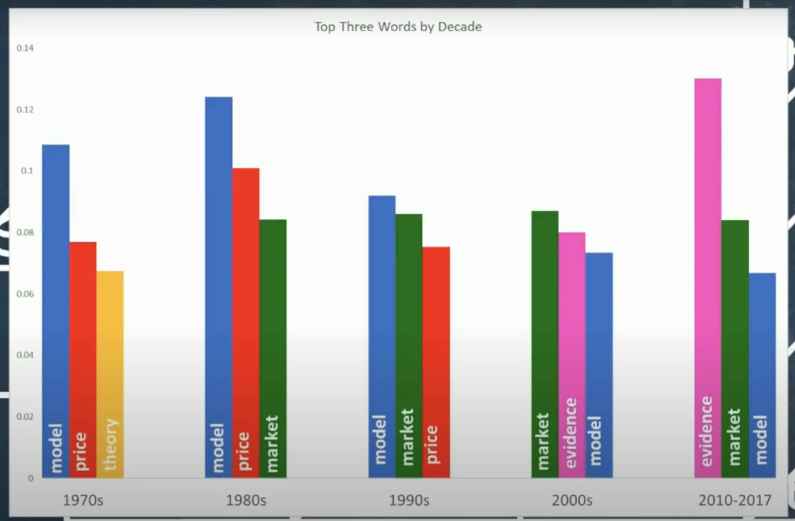
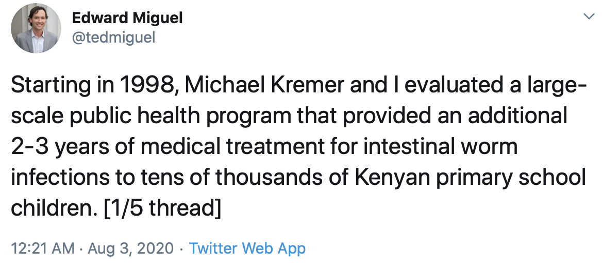
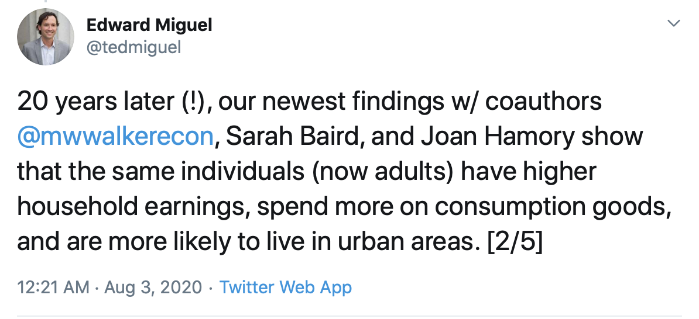
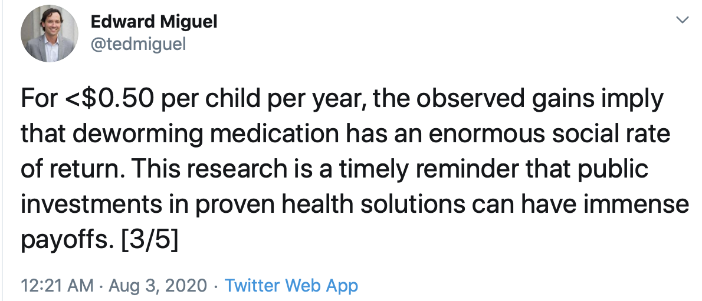
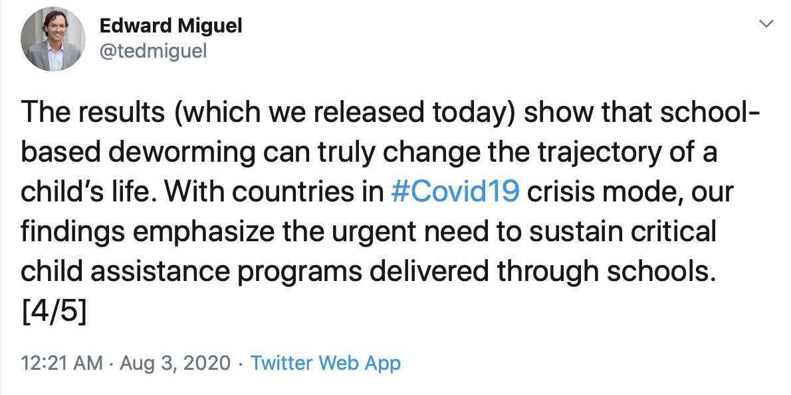
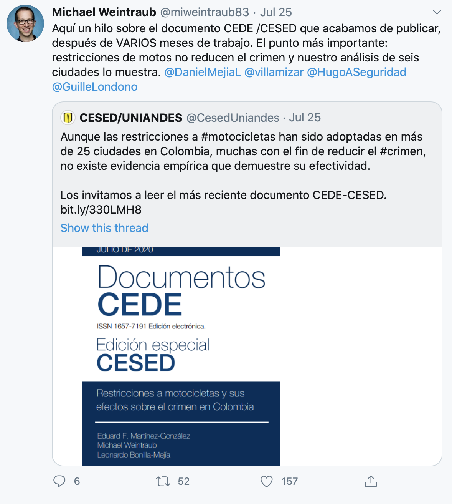

class: inverse, middle

```{r, setup, include = F}

#devtools::install_github("dill/emoGG")
library(pacman)
p_load(
  broom, tidyverse,
  latex2exp, ggplot2, ggthemes, ggforce, viridis, extrafont, gridExtra,
  kableExtra, snakecase, janitor,
  data.table, dplyr, estimatr,
  lubridate, knitr, parallel,
  lfe,
  here, magrittr
)
# Define pink color
red_pink <- "#e64173"
turquoise <- "#20B2AA"
orange <- "#FFA500"
red <- "#fb6107"
blue <- "#2b59c3"
green <- "#8bb174"
grey_light <- "grey70"
grey_mid <- "grey50"
grey_dark <- "grey20"
purple <- "#6A5ACD"
slate <- "#314f4f"
# Dark slate grey: #314f4f
# Knitr options
opts_chunk$set(
  comment = "#>",
  fig.align = "center",
  fig.height = 7,
  fig.width = 10.5,
  warning = F,
  message = F
)
opts_chunk$set(dev = "svg")
options(device = function(file, width, height) {
  svg(tempfile(), width = width, height = height)
})
options(crayon.enabled = F)
options(knitr.table.format = "html")
# A blank theme for ggplot
theme_empty <- theme_bw() + theme(
  line = element_blank(),
  rect = element_blank(),
  strip.text = element_blank(),
  axis.text = element_blank(),
  plot.title = element_blank(),
  axis.title = element_blank(),
  plot.margin = structure(c(0, 0, -0.5, -1), unit = "lines", valid.unit = 3L, class = "unit"),
  legend.position = "none"
)
theme_simple <- theme_bw() + theme(
  line = element_blank(),
  panel.grid = element_blank(),
  rect = element_blank(),
  strip.text = element_blank(),
  axis.text.x = element_text(size = 18, family = "STIXGeneral"),
  axis.text.y = element_blank(),
  axis.ticks = element_blank(),
  plot.title = element_blank(),
  axis.title = element_blank(),
  # plot.margin = structure(c(0, 0, -1, -1), unit = "lines", valid.unit = 3L, class = "unit"),
  legend.position = "none"
)
theme_axes_math <- theme_void() + theme(
  text = element_text(family = "MathJax_Math"),
  axis.title = element_text(size = 22),
  axis.title.x = element_text(hjust = .95, margin = margin(0.15, 0, 0, 0, unit = "lines")),
  axis.title.y = element_text(vjust = .95, margin = margin(0, 0.15, 0, 0, unit = "lines")),
  axis.line = element_line(
    color = "grey70",
    size = 0.25,
    arrow = arrow(angle = 30, length = unit(0.15, "inches")
  )),
  plot.margin = structure(c(1, 0, 1, 0), unit = "lines", valid.unit = 3L, class = "unit"),
  legend.position = "none"
)
theme_axes_serif <- theme_void() + theme(
  text = element_text(family = "MathJax_Main"),
  axis.title = element_text(size = 22),
  axis.title.x = element_text(hjust = .95, margin = margin(0.15, 0, 0, 0, unit = "lines")),
  axis.title.y = element_text(vjust = .95, margin = margin(0, 0.15, 0, 0, unit = "lines")),
  axis.line = element_line(
    color = "grey70",
    size = 0.25,
    arrow = arrow(angle = 30, length = unit(0.15, "inches")
  )),
  plot.margin = structure(c(1, 0, 1, 0), unit = "lines", valid.unit = 3L, class = "unit"),
  legend.position = "none"
)
theme_axes <- theme_void() + theme(
  text = element_text(family = "Fira Sans Book"),
  axis.title = element_text(size = 18),
  axis.title.x = element_text(hjust = .95, margin = margin(0.15, 0, 0, 0, unit = "lines")),
  axis.title.y = element_text(vjust = .95, margin = margin(0, 0.15, 0, 0, unit = "lines")),
  axis.line = element_line(
    color = grey_light,
    size = 0.25,
    arrow = arrow(angle = 30, length = unit(0.15, "inches")
  )),
  plot.margin = structure(c(1, 0, 1, 0), unit = "lines", valid.unit = 3L, class = "unit"),
  legend.position = "none"
)
theme_set(theme_gray(base_size = 20))
# Column names for regression results
reg_columns <- c("Term", "Est.", "S.E.", "t stat.", "p-Value")
# Function for formatting p values
format_pvi <- function(pv) {
  return(ifelse(
    pv < 0.0001,
    "<0.0001",
    round(pv, 4) %>% format(scientific = F)
  ))
}
format_pv <- function(pvs) lapply(X = pvs, FUN = format_pvi) %>% unlist()
# Tidy regression results table
tidy_table <- function(x, terms, highlight_row = 1, highlight_color = "black", highlight_bold = T, digits = c(NA, 3, 3, 2, 5), title = NULL) {
  x %>%
    tidy() %>%
    select(1:5) %>%
    mutate(
      term = terms,
      p.value = p.value %>% format_pv()
    ) %>%
    kable(
      col.names = reg_columns,
      escape = F,
      digits = digits,
      caption = title
    ) %>%
    kable_styling(font_size = 20) %>%
    row_spec(1:nrow(tidy(x)), background = "white") %>%
    row_spec(highlight_row, bold = highlight_bold, color = highlight_color)
}
# A few extras
xaringanExtra::use_xaringan_extra(c("tile_view", "fit_screen"))
```


---
class: clear
name: schedule

## Hoy

- Bienvenidos, reglas de juego
- Fundamentos de investigación: *¿Por qué estamos aquí?* .grey-vlight[*MHE*: Prefacio y Capítulo 1]
- Nuestra clase: *¿Qué estamos haciendo?*

## Próximamente

- Aprender más .mono[Stata]: ¡Primer Taller!
- Revisar técnicas y desarrollar intuición para causalidad e inferencia.


## A largo plazo

.hi[Objetivo:] Profundizar en la comprensión y la intuición para la causalidad y la inferencia.

---

---

name: why

## ¿Por qué estamos aquí?

--

- .hi[Investigación económica]
--
.hi[:] Comprender los comportamientos humanos, sociales y/o económicos.

--

- .hi[Maestría]
--
.hi[:] Aprender métodos, herramientas, habilidades e intuición necesarios para la investigación.

--

- .hi[Econometría (Aplicada)]
--
.hi[:] Construir un conjunto de herramientas de .pink[*métodos empíricos*, herramientas y habilidades] que combinan datos y conocimientos estadísticos para probar y/o medir teorías y políticas.

--

- .hi[Tú]
--
.hi[:] Deberías estar pensando en esta pregunta a lo largo de tu programa/trabajo/vida.

---
# Esta clase

Aunque las calificaciones no son muy importantes .bigger[🤷], son necesarias.

- 25% Parcial 1
- 25% Parcial 2
- 20% Talleres Casa
- 5% Talleres Clase
- 25% Trabajo Final
-- Primera entrega. (10%) Presentación de la idea de investigación
Segunda entrega (20%). 5 páginas de introducción, análisis descriptivo y descripción de la metodología.
Entrega final (30%). Documento definitivo. 
Sustentación.(40%) 

--

El material y las herramientas son fundamentales para **mucho** de lo que harás en el futuro.

--

.hi[Toma responsabilidad de tu educación y carrera.]

- Comprométete a dedicar el tiempo necesario.
- Sé proactivo y curioso.
- Adéntrate en temas específicos.
- Haz preguntas.
- Aprende.

---

## ¿Qué estamos haciendo?

.hi[P] ¿Cuál es la diferencia entre *econometría* y *ciencia de datos*?
--
<br>.hi[P].sub[.pink[v2]] ¿Hay algo especial acerca de la *econometría*?

--

.hi[R].pink[.sub[1/∞]] Causalidad.<sup>.smallest[😸]</sup>

.footnote[
😸 Fuentes para esta Pregunta y Respuesta: [Dan Hammer](https://www.danham.me/r/about.html) y [Max Auffhammer](https://www.auffhammer.com/).
<br>.tran[blah]
]

--

La causalidad juega un *papel enorme* en la econometría aplicada moderna (especialmente en microeconomía).

---
# Libros
layout: false
class: clear

.pull-left[
.hi-pink[Guía Práctica para la Evaluación de Impacto]
<br>*Ximena Peña y Raquel Bernal, 2008*
```{r, libro1, out.width = "50%", echo = F}

```
]
.pull-right[
.b.red[Causal Inference: The Mixtape]
<br>*Scott Cunningham, 2021*
```{r, libro2, out.width = "50%", echo = F}

```

Relativamente nuevo
<br>[Incluye](https://mixtape.scunning.com/index.html) R, Stata, and Python code.


]
---

layout: true

# Investigación causal


---
# ¿Qué es Economía?

[https://PollEv.com/anamariadiaz707](https://PollEv.com/anamariadiaz707)

---

# ¿Qué es Economía?

[https://www.youtube.com/watch?v=iiYKRD8ochA](https://www.youtube.com/watch?v=iiYKRD8ochA)

.pull-left[
.b.blue[Oriana Bandeira]
```{r, ORIANA.png, out.width = "60%", echo = F}

```
]

---
---

## Motivación

> En primer lugar, creemos que .pink[la investigación empírica es más valiosa cuando utiliza datos para responder preguntas causales específicas, *como si* se tratara de un ensayo clínico aleatorizado.] Esta perspectiva moldea nuestro enfoque hacia la mayoría de las preguntas de investigación. En ausencia de un experimento real, buscamos comparaciones bien controladas y/o cuasiexperimentos naturales. Por supuesto, algunos diseños de investigación cuasiexperimentales son más convincentes que otros, pero .purple[los métodos econométricos utilizados en estos estudios suelen ser bastante simples].

*Mostly Harmless Econometrics*, p. xii 

--

.pink[1\. Esta ideología compara inherentemente la investigación con ensayos clínicos aleatorizados.]


---
## Microeconometría

- Efectos Causales
- Formulación de políticas basadas en evidencia (CCTs, Incentivos, Costo-beneficio)
- Entender Mecanismos (teoría económica)

---

## Microeconometría - Política Pública

- Directos:
  1. Asignación eficiente de los recursos
  2. Mejorar la calidad, la eficiencia y la efectividad de las intervenciones
  3. Centrarse en resultados
  4. Establecer la existencia de efectos no esperados en la ejecución de un programa
  5. Rendición de cuentas

- Indirectos:
  1. Debate público

---

## Microeconometría - Teoría Económica

- Mejor y más información
- Menos distracciones
- Mejor Diseño
- Discusión transparente del diseño
- Retroalimentación

---

## Ejemplos Exitosos 1: Progresa (Oportunidades México) 1990

- Objetivos:
  - Ofrecer a los hogares pobres un ingreso monetario de corto plazo y crear incentivos para que los niños aumenten su capital humano
- ¿Cómo?
  - Transferencias condicionadas a que los niños asistieran al colegio y visitaran regularmente un centro de salud

---

## Resultados Iniciales 2001

- El programa estaba bien focalizado y había generado cambios importantes en el capital humano de los hogares
- Shultz(2004): Progresa aumentó la asistencia escolar en 0.7 años
- Gertler(2001): La incidencia de enfermedades disminuyó en un 23%

---

## Resultados Generales


---

## Resultados Generales


---

## Ejemplos Exitosos 2: Desparasitación



---

## Desparasitación



---

## Desparasitación



---

## Desparasitación



---

## Ejemplos Exitosos 3: El Parrillero



---

## Ejemplos Exitosos 3: El Parrillero


---

name: faqs

## Preguntas frecuentes de Angrist y Pischke<sup>.pink[†]</sup>

.footnote[
.pink[†] Consulta *MHE*, capítulo 1.
.pink[††] Estas preguntas son de [Reed Walker](https://w-reed-walker.com/).
]

1. ¿Cuál es la .hi[relación causal de interés]?

2. ¿Cómo capturaría un .hi[experimento ideal] este efecto causal de interés?

3. ¿Cuál es tu .hi[estrategia de identificación]?

4. ¿Cuál es tu .hi[modo de inferencia]?

--

***Nota:*** Otras preguntas también importan para desarrollar una investigación de calidad, *por ejemplo*,<sup>.pink[††]</sup>

- ¿Por qué tu pregunta es .hi[importante/interesante]?
- ¿Por qué la .hi[literatura actual] carece o es inexistente?
- ¿Cómo propones .hi[avanzar en la literatura]?

---
name: faq1

## Pregunta frecuente.sub[1]: ¿Cuál es la relación causal de interés?

Los ejercicios descriptivos pueden ser [muy interesantes e importantes](https://www.opportunityatlas.org/), pero en la econometría aplicada moderna, .hi-purple[la causalidad es la reina].

**¿Por qué?**

--

- Las relaciones causales .hi-purple[ponen a prueba directamente] las teorías sobre cómo funciona el mundo.

- Las relaciones causales nos proporcionan .hi-purple[*contrafactuales*].

--

🚧 Si no puedes nombrar claramente y de manera concisa la relación causal de interés, es posible que no tengas realmente un proyecto de investigación.

---

## Pregunta frecuente.sub[1]: ¿Cuál es la relación causal de interés?

*Algunos ejemplos clásicos...*

**Trabajo y educación**<br>¿Cómo afecta un año adicional de educación a los salarios?

**Economía política y desarrollo**<br>¿Cómo afectan las instituciones democráticas al desarrollo económico?

**Medio ambiente y áreas urbanas**<br>¿Los pobres reciben beneficios sustanciales de la limpieza del medio ambiente?

**Salud, crimen y derecho**<br>¿Las leyes de control de armas realmente reducen la violencia armada?

---
name: faq2

## Pregunta frecuente.sub[2]: ¿Cuál es el experimento ideal para esta situación?

Describir el *experimento ideal* nos ayuda a formular

- las .pink[preguntas causales exactas]

- las dimensiones que queremos .pink[manipular]

- los factores que necesitamos .pink[mantener constantes]

--

🚧 Estos *experimentos ideales* suelen ser hipotéticos, pero si no puedes describir el ideal, probablemente será difícil obtener datos y diseños de investigación plausibles en la vida real.

--

Angrist y Pischke llaman preguntas sin experimentos ideales "preguntas fundamentalmente sin respuesta".

---

## Pregunta frecuente.sub[2]: ¿Cuál es el experimento ideal para esta situación?

*Ejemplos de preguntas potencialmente respondibles...*

- **El efecto de la educación en los salarios:** Asignar al azar becas o incentivos para permanecer en el sistema educativo.
- **Democracia y desarrollo:** Asignar arbitrariamente tipos institucionales a los países al obtener su independencia.
- **Limpieza del medio ambiente:** Pedir a la Secretaría de Medio Ambiente que limpie aleatoriamente sitios tóxicos.
- **Leyes de control de armas:** Asignar restricciones de armas aleatoriamente a cuadrantes.

--

*Ejemplos de preguntas desafiantes de responder (¿potencialmente sin respuesta?)...*

- ¿Cómo afecta el género a las trayectorias profesionales futuras?
- ¿Qué papel juega la raza en los salarios de una persona?

---

## Pregunta frecuente.sub[2]: ¿Cuál es el experimento ideal para esta situación?

A veces, incluso preguntas que parecen simples resultan ser fundamentalmente sin respuesta.

*Ejemplo de una pregunta fundamentalmente sin respuesta*:
> ¿Los niños tienen un mejor rendimiento al comenzar la escuela a una edad más avanzada?

--

**Propuesta de experimento ideal**

1. Asignar al azar a los niños para comenzar el 1.er grado a los 6 o 7 años.
2. Comparar los resultados de las pruebas en el 2.º grado.

--

.hi[Problema]
--
Los niños mayores tienen un mejor rendimiento. ¿Queremos medir el efecto de comenzar más tarde o simplemente de ser mayor?

---


# Conceptos Importantes

### El Contrafactual

¿Cuál habría sido el resultado para los participantes si NO hubieran participado en él?

---

## El Contrafactual

.pull-left[
.b.blue[Participante]
```{r, ninas1, out.width = "40%", echo = F}

```
  $Y_1 \Rightarrow$ RESULTADO OBSERVADO
]
.pull-right[
.b.blue[No Participante]
```{r, ninas1c, out.width = "40%", echo = F}

```
 $Y_0 \Rightarrow$ RESULTADO DEL CONTRAFACTUAL
 ]

---

## Resultados Potenciales

Para cada individuo, tenemos DOS resultados potenciales:

- $Y_i(D=0)$: resultado si $i$ NO recibe el tratamiento
- $Y_i(D=1)$: resultado si $i$ recibe el tratamiento

---

## Resultados Potenciales: Ejemplo 1

Carolina tiene una pierna rota. Tratamiento: $D=0$ No ir al hospital, $D=1$ Ir al hospital

- $Y_i(D=0)$: si ella no va al hospital, su pierna no se recupera
- $Y_i(D=1)$: si ella va al hospital, su pierna no se recupera

---

## Resultados Potenciales: Ejemplo 2

Camila tiene una pierna rota. Tratamiento: $D=0$ No ir al hospital, $D=1$ Ir al hospital

- $Y_i(D=0)$: si ella no va al hospital, su pierna no se recupera
- $Y_i(D=1)$: si ella va al hospital, su pierna se recupera

---

## Resultados Potenciales: Ejemplo 3

Mónica tiene una pierna rota. Tratamiento: $D=0$ No ir al hospital, $D=1$ Ir al hospital

- $Y_i(D=0)$: si ella no va al hospital, su pierna se recupera
- $Y_i(D=1)$: si ella va al hospital, su pierna no se recupera

---

## Problema Fundamental de Inferencia Causal

Nunca observamos los dos resultados potenciales para el mismo individuo. Crea un problema de datos no observados (missing data) al comparar tratados con los controles.

---

## Resultado Observado

Nosotros solo observamos uno de los resultados potenciales. Nuestra variable $Y_i$:

$$Y_i = \begin{cases}
  Y_i(D=0) & \text{si } D_i = 0 \\
  Y_i(D=1) & \text{si } D_i = 1 \\
\end{cases}$$

Donde $D_i$ es el indicador de tratamiento (es igual a 1 si fue tratado).

---

## Establecer Causalidad

En el mundo ideal (para los investigadores), podríamos clonar a cada individuo tratado y observar los impactos del tratamiento en los resultados de interés.

.pull-left[
.b.blue[Tratado]
```{r, ninas1a, out.width = "40%", echo = F}

```
  $Y_1 \Rightarrow$ RESULTADO OBSERVADO
]
.pull-right[
.b.blue[Control]
```{r, ninas1b, out.width = "40%", echo = F}

```
 $Y_0 \Rightarrow$ RESULTADO DEL CONTRAFACTUAL
 ]

---

---

## Video Mastering Metrics

[Ver video](https://youtu.be/iPBV3BlV7jk)

---
---
class: center, middle, inverse

## Ceteris Paribus

### Todos los demás factores permanecen constantes

---

## Establecer Causalidad

- Nosotros nunca observamos el contrafactual
- Soluciones
  - Buscar una persona similar en todas las características
  - Diferencias de medias de grupos (naïve --> Sesgo de Selección)
  - Diferencias antes y después (naïve --> Sesgo de maduración)
---

## Solución 1. Buscar una persona similar 

**Ceteris Paribus: ¿PERFECTO?**

.pull-left[ **Tratada** 
```{r,  out.width = "40%", echo = F}

```
- $Y_{1} \Rightarrow$ RESULTADO OBSERVADO
]

.pull-right[ **Control** 
```{r, ninas3, out.width = "35%", echo = F}

```
- $Y_{0} \Rightarrow$ RESULTADO DEL CONTRAFACTUAL
]

---

## Efecto promedio del tratamiento (Average Treatment Effect- ATE)

$$ATE = E[\tau] = E[Y_i(D=1) - Y_i(D=0)]$$
Si no observamos los resultados potenciales para cada individuo, mucho menos para un grupo de individuos.

---

## Solución 2: Diferencia de Medias= Efecto Causal + Sesgo de Selección

.pull-left[ **Tratados** 
```{r,  out.width = "40%", echo = F}
include_graphics("img/pegado3.png")
```
]

.pull-right[ **Controles** 
```{r,  out.width = "40%", echo = F}

```
]
---
---

## SESGO DE SELECCIÓN

Hay diferencias sistemáticas entre los grupos comparados de un estudio.

---

## Sesgo de Selección

Incluso en una muestra grande:

- Las personas eligen participar en un programa cuando esperan tener beneficios de él $(Y_i(D=1)-Y_i(D=0)$
- Es probable que las personas que eligen participar sean diferentes a las que deciden no hacerlo ... incluso en ausencia del tratamiento.

---

## Solución 3: Diferencias Antes-Después = Efecto Causal + Efecto de Maduración

Comparaciones antes-después asumen que no hay tendencia en la variable de resultado.

---

## COMPARACIONES PROHIBIDAS

- Tratados vs Controles
- Pre-tratamiento vs Post-tratamiento

Se requieren supuestos extremadamente fuertes (léase: imposibles de cumplir en la realidad) para que cualquiera de estos dos enfoques podamos obtener efectos causales.

---

## ¿Y Entonces?

.pull-left[
```{r, simon11, out.width = "60%", echo = F}
include_graphics("img/simon1.jpeg")
```
.fuente[ fuente: @banrepcultural]
]


---

## ¿Cómo podemos estimar efectos causales?

**Experimentos Controlados**
- Asignación aleatoria al tratamiento

**Métodos Cuasi-Experimentales**
- Diferencias en Diferencias
- Emparejamiento
- Variables Instrumentales
- Regresión Discontinua
- Función de Control
- Controles Sintéticos
- Causal Machine Learning


---
class: center, middle

# Gracias!

Slides created via the R package [**xaringan**](https://github.com/yihui/xaringan).
